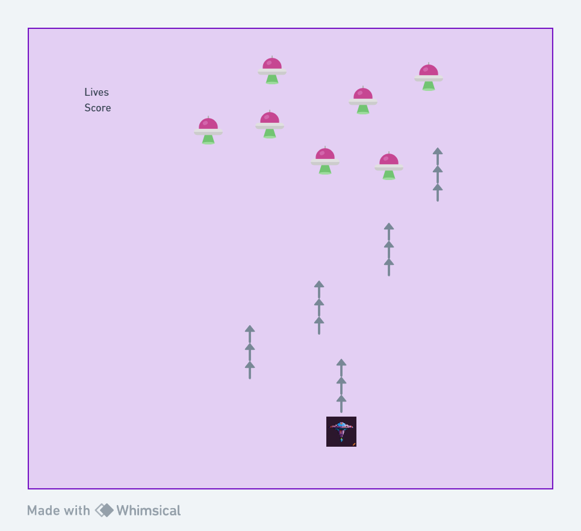

# README

## Space Invader Game

## Description
This is a space invader game using the canvas from javascript. It will have the simple functions of shooting invaders, gaining score, and progressively more difficult fights.

### MVP (Minimum Viable Product)

- [x] Create the spaceship and allow horizontal movement with left and right arrow.

- [x] Spawn random enemies on the screen.

- [x] Allow the user to shoot out missiles through space bar button.

- [x] Create a life counter to tell user how many lives are left

- [x] Create a score feature to track how many aliens are shot down.

- [x] Create a game over feature if too many aliens pass space ship.

### PMVP (Post Minimum Viable Product)

- [x] Create a instructions for the game

- [x] Add progressively difficult fights

- [x] Add SFX

- [x] Update Background of game

## Wireframe

